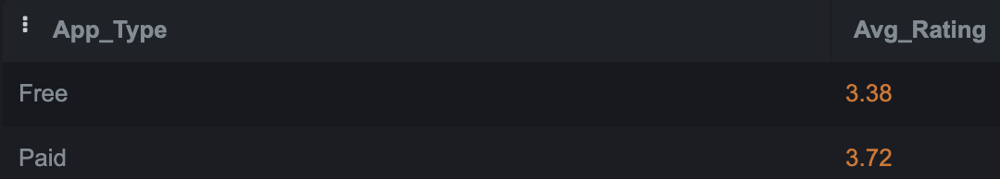

# Apple App Store Analytics with SQL
In the dynamic world of mobile applications, the Apple App Store stands as a vibrant marketplace hosting a diverse array of apps catering to every conceivable need. In this era of digital transformation, understanding the intricate dynamics of app popularity, pricing strategies, and user engagement is pivotal for app managers and developers seeking to carve their niche in this competitive landscape. This project aims to assist managers in making informed marketing decisions by addressing the following questions:

* Which app categories are the most popular?
* What price should be set?
* How to maximize user ratings?

## Table of contents
* [Dataset](#Dataset)
* [Method](#Method)
* [Implementation](#Implementation)
* [Conclusion](#Findings-and-conclusion)

## Dataset
The source of the dataset is from [Kaggle](https://www.kaggle.com/datasets/gauthamp10/apple-appstore-apps), and I utilized datasets from a mentor's [google drive](https://drive.google.com/drive/folders/14O9xB8N1gXN_67ouphImQkvpzyitmTfR), where the orignal dataset is divided into 4 smaller portions, allowing me to work with them in an SQLite online environment due to the size limit.
	

## Method	
The process involves mainly exploratory data analysis (EDA) to uncover insights through data analysis.

## Implementation
Project is created with:
* SQLite 0.1.3 beta

## Findings and Conclusion
Paid apps tend to have a better average rating (3.7) compared to free ones (3.4). This could be attributed to paid users' higher engagement and their perceived value of the apps. 

Apps supporting between 10 and 30 languages tend to have the highest average ratings (4.1), compared to those supporting fewer than 10 (3.4) or more than 30 (3.8) languages. This suggests that developers should focus on selecting the appropriate languages for their target audience. 

Catalogs, Finance, and Book apps exhibit the lowest average ratings with scores of 2.1, 2.4, and 2.5 respectively. This implies potential opportunities for gaining market share by enhancing the quality of these apps. 

A positive correlation exists between description length and ratings. This suggests that users appreciate well-described apps and have reasonable expectations. 

The Games and Entertainment categories feature a higher volume of apps, indicating a relatively competitive market. 

Overall, the apps have an average rating of 3.5, which could serve as a baseline for the company's performance.

The list of top-rated apps per category can serve as a reference for product improvement and development.

To address the main questions

* The most popular app categories are Games and Entertainment.
* A price range of $31 to $60 could be considered.

* To maximize user ratings, consider offering paid apps, exploring less saturated markets like Finance or Books, focusing on necessary languages for target countries, and providing a detailed app description to meet user expectations.
Future projects could focus on unveiling deeper insights through sentiment analysis and visualizations, thereby painting a more comprehensive picture of app performance.

 

